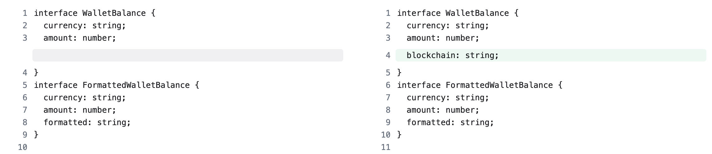
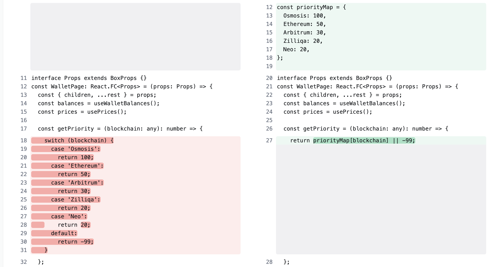
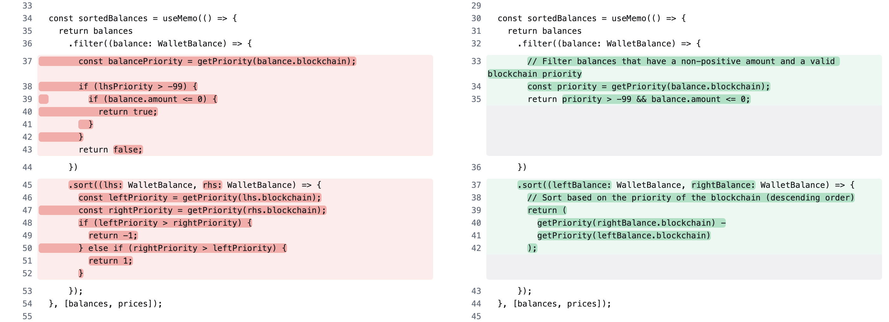
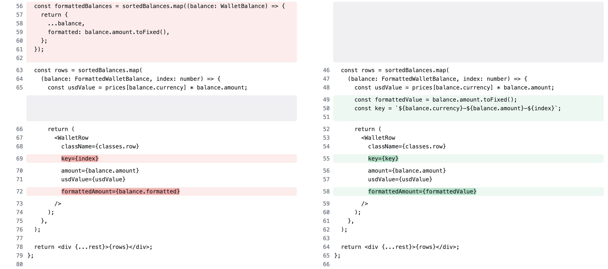

### Changes made

1. Add `blockchain` field to WalletBalance interface since this is used in the code without defining
   

2. Turn `getPriority()` switch case to object lookup for O(1) retrieval. Switch case becomes inefficient as the number of cases increases because it has to evaluate each case until it finds a match.
   

3. Simplify the filtering, sorting and if else logic. Add comments to make to core conditions clearer.
   

4. Remove `formattedBalances` since it's inefficient, we don't need to loop over `sortedBalances` then spread the balance just to override the `formatted` field. Instead we can define an additional variable `const formattedValue = balance.amount.toFixed();` within the map loop

   Additional, replace key using `index` with combination of `balance.currency`, `balance.amount` and `index`
   
